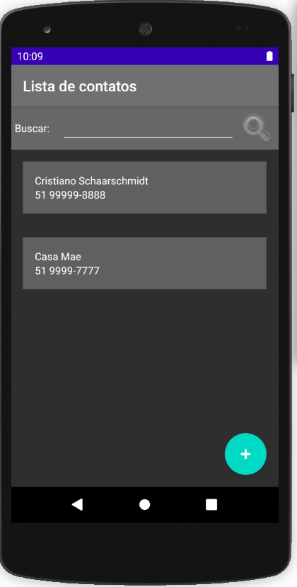
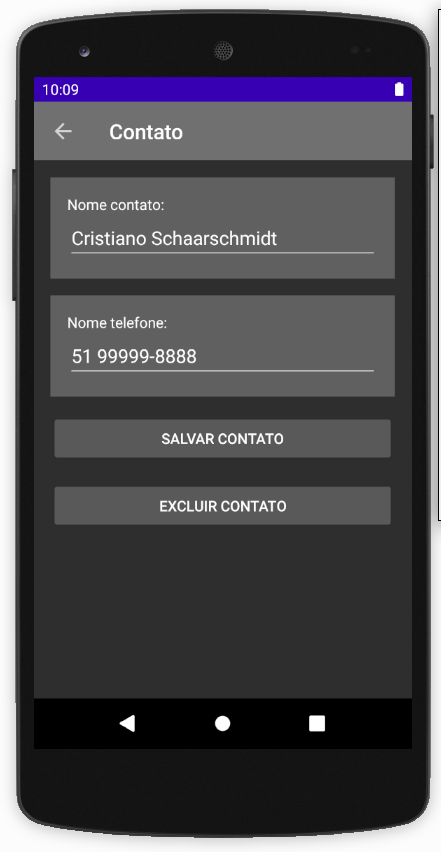
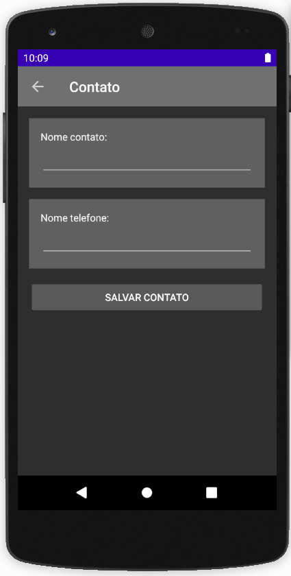

# Lista de Contatos em Kotlin / Android Studio

## Descrição

Aplicativo Android desenvolvido em Kotlin que permite a inserção, atualização e excução de contatos em uma lista.

Os dados são persistidos em um banco SQLite.

Tela Inicial

Tela de Consulta e Atualização

Tela de Cadastro de Contatos

